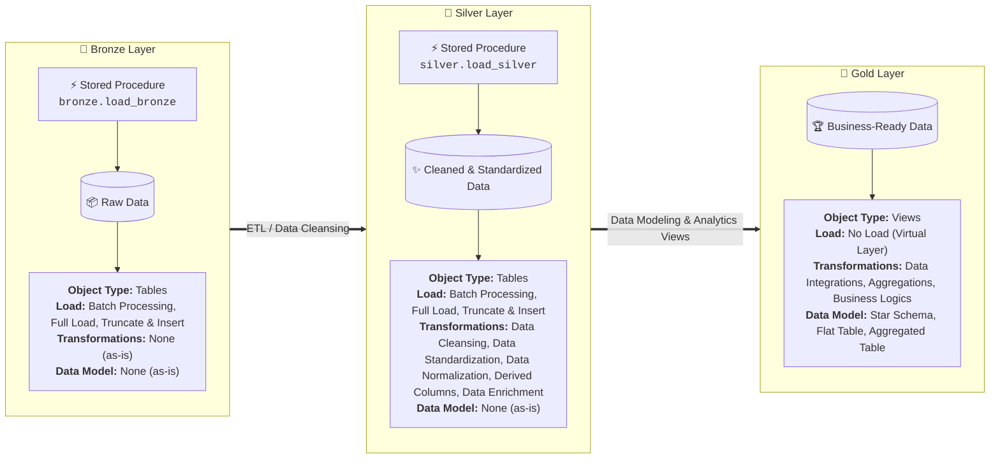
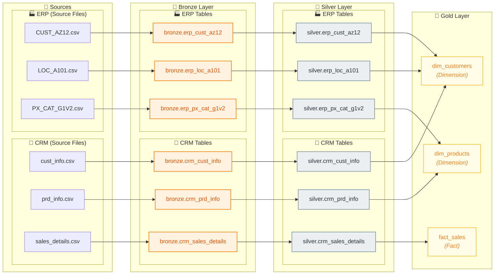
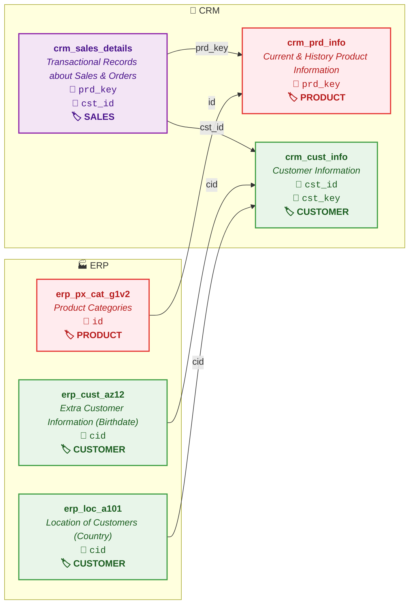

# 🏗️ SQL Data Warehouse Project

Dự án xây dựng hệ thống **Modern Data Warehouse** từ đầu đến cuối (End-to-End) sử dụng **Microsoft SQL Server (T-SQL)** theo kiến trúc phân lớp **Medallion Architecture** (Bronze ➔ Silver ➔ Gold). Dự án bao gồm toàn bộ quy trình ETL/ELT, Data Cleaning, Data Transformation, Data Modeling (Star Schema) và phục vụ phân tích dữ liệu (Analytics & BI).

---

## 📌 Mục lục
- [1. Kiến trúc tổng quan (Medallion Architecture)](#1-kiến-trúc-tổng-quan-medallion-architecture)
- [2. Luồng dữ liệu & Nguồn gốc (Data Flow / Data Lineage)](#2-luồng-dữ-liệu--nguồn-gốc-data-flow--data-lineage)
- [3. Mô hình tích hợp nguồn dữ liệu (Integration Model)](#3-mô-hình-tích-hợp-nguồn-dữ-liệu-integration-model)
- [4. Cấu trúc thư mục](#4-cấu-trúc-thư-mục)
- [5. Chi tiết các tầng dữ liệu (Data Layers)](#5-chi-tiết-các-tầng-dữ-liệu-data-layers)
  - [Bronze Layer (Raw Data)](#-bronze-layer-raw-data)
  - [Silver Layer (Cleaned & Standardized Data)](#-silver-layer-cleaned--standardized-data)
  - [Gold Layer (Business-Ready Data)](#-gold-layer-business-ready-data)
- [6. Nguồn dữ liệu (Data Sources)](#6-nguồn-dữ-liệu-data-sources)
  - [Hệ thống CRM](#-hệ-thống-crm)
  - [Hệ thống ERP](#-hệ-thống-erp)
- [7. Hướng dẫn cài đặt & Thực thi](#7-hướng-dẫn-cài-đặt--thực-thi)
  - [Bước 1: Khởi tạo Database & Schemas](#bước-1-khởi-tạo-database--schemas)
  - [Bước 2: Tạo DDL & Nạp dữ liệu tầng Bronze](#bước-2-tạo-ddl--nạp-dữ-liệu-tầng-bronze)
  - [Bước 3: Làm sạch & Chuyển đổi sang tầng Silver](#bước-3-làm-sạch--chuyển-đổi-sang-tầng-silver)
  - [Bước 4: Xây dựng Dimensional Model tầng Gold](#bước-4-xây-dựng-dimensional-model-tầng-gold)
  - [Bước 5: Kiểm tra chất lượng dữ liệu (Data Quality Checks)](#bước-5-kiểm-tra-chất-lượng-dữ-liệu-data-quality-checks)
- [8. Giám sát & Xử lý lỗi (Error Handling & Logging)](#8-giám-sát--xử-lý-lỗi-error-handling--logging)
- [9. Công nghệ sử dụng](#9-công-nghệ-sử-dụng)

---

## 1. Kiến trúc tổng quan (Medallion Architecture)

Hệ thống Data Warehouse được thiết kế theo mô hình 3 tầng chuẩn (Bronze ➔ Silver ➔ Gold):



### 📋 So sánh đặc điểm các tầng (Layer Comparison)

| Tiêu chí | 🥉 Bronze Layer | 🥈 Silver Layer | 🥇 Gold Layer |
| :--- | :--- | :--- | :--- |
| **Trạng thái dữ liệu** | Dữ liệu thô (Raw Data) | Dữ liệu sạch, chuẩn hóa (Cleaned, Standardized Data) | Dữ liệu sẵn sàng cho nghiệp vụ (Business-Ready Data) |
| **Loại đối tượng (Object Type)** | `Tables` | `Tables` | `Views` |
| **Cơ chế nạp (Load)** | • Batch Processing<br/>• Full Load<br/>• Truncate & Insert | • Batch Processing<br/>• Full Load<br/>• Truncate & Insert | • **No Load** (Truy vấn trực tiếp qua Views) |
| **Chuyển đổi (Transformations)** | **No Transformations** | • Data Cleansing<br/>• Data Standardization<br/>• Data Normalization<br/>• Derived Columns<br/>• Data Enrichment | • Data Integrations<br/>• Aggregations<br/>• Business Logics |
| **Mô hình hóa (Data Model)** | None (as-is) | None (as-is) | • Star Schema (Facts & Dimensions)<br/>• Flat Table<br/>• Aggregated Table |

---

## 2. Luồng dữ liệu & Nguồn gốc (Data Flow / Data Lineage)

Sơ đồ thể hiện chi tiết nguồn gốc và dòng chảy dữ liệu (Data Lineage) từ các tập tin nguồn qua từng tầng, được phân nhóm **CRM hoàn chỉnh trước rồi đến ERP**:



### 🔄 Chi tiết luồng tích hợp tầng Gold:
- **`gold.dim_customers`**: Tích hợp từ `silver.crm_cust_info` (CRM) + `silver.erp_cust_az12` (ERP) + `silver.erp_loc_a101` (ERP).
- **`gold.dim_products`**: Tích hợp từ `silver.crm_prd_info` (CRM) + `silver.erp_px_cat_g1v2` (ERP).
- **`gold.fact_sales`**: Nạp từ `silver.crm_sales_details` (CRM).

---

## 3. Mô hình tích hợp nguồn dữ liệu (Integration Model)

Sơ đồ thể hiện mối quan hệ giữa các bảng nguồn từ 2 hệ thống **CRM** và **ERP** theo các miền nghiệp vụ (**Domain: CUSTOMER, PRODUCT, SALES**):



### 🏷️ Phân loại theo Miền nghiệp vụ (Business Domains):
- 🟢 **CUSTOMER (Khách hàng)**:
  - `crm_cust_info` (CRM - Thông tin định danh, tên, hôn nhân, giới tính)
  - `erp_cust_az12` (ERP - Ngày sinh `bdate`, giới tính `gen`) liên kết qua `cid = cst_key`
  - `erp_loc_a101` (ERP - Vị trí quốc gia `cntry`) liên kết qua `cid = cst_key`
- 🔴 **PRODUCT (Sản phẩm)**:
  - `crm_prd_info` (CRM - Thông tin sản phẩm, giá vốn, dòng sản phẩm, ngày hiệu lực)
  - `erp_px_cat_g1v2` (ERP - Danh mục `cat`, tiểu mục `subcat`, bảo trì `maintenance`) liên kết qua `id = cat_id`
- 🟣 **SALES (Bán hàng & Đơn hàng)**:
  - `crm_sales_details` (CRM - Chi tiết đơn hàng, số lượng, doanh thu) liên kết tới Sản phẩm qua `prd_key` và Khách hàng qua `cst_id`

---

## 4. Cấu trúc thư mục

```plaintext
sql-data-warehouse-project/
├── datasets/                 # Chứa các file dữ liệu nguồn (.csv)
│   ├── source_crm/           # Dữ liệu từ hệ thống CRM (Khách hàng, Sản phẩm, Bán hàng)
│   │   ├── cust_info.csv
│   │   ├── prd_info.csv
│   │   └── sales_details.csv
│   └── source_erp/           # Dữ liệu từ hệ thống ERP (Vị trí, Phân loại, Danh mục)
│       ├── CUST_AZ12.csv
│       ├── LOC_A101.csv
│       └── PX_CAT_G1V2.csv
├── docs/                     # Tài liệu thiết kế, Data Dictionary, Kiến trúc hệ thống
├── scripts/                  # Mã nguồn SQL và Stored Procedures
│   ├── init_database.sql     # Khởi tạo Database 'DataWarehouse' và các schema
│   ├── bronze/               # Scripts định nghĩa DDL và nạp dữ liệu tầng Bronze
│   │   ├── ddl_bronze.sql
│   │   └── proc_load_bronze.sql
│   ├── silver/               # Scripts định nghĩa DDL và làm sạch/nạp dữ liệu tầng Silver
│   │   ├── ddl_silver.sql
│   │   └── proc_load_silver.sql
│   └── gold/                 # Scripts xây dựng Dimension & Fact Views/Tables tầng Gold
│       └── ddl_gold.sql
└── tests/                    # Scripts kiểm thử chất lượng dữ liệu & Data Quality Checks
    ├── quality_checks_silver.sql # Kiểm tra chất lượng dữ liệu tầng Silver
    └── quality_checks_gold.sql   # Kiểm tra chất lượng dữ liệu tầng Gold
```

---

## 5. Chi tiết các tầng dữ liệu (Data Layers)

### 🥉 Bronze Layer (Raw Data)
* **Mục tiêu**: Lưu trữ toàn bộ dữ liệu thô nguyên bản từ các file CSV của CRM & ERP mà không qua xử lý.
* **Đặc điểm**:
  - Dữ liệu dạng thô (as-is), kiểu dữ liệu chuỗi hoặc định dạng gốc.
  - Sử dụng lệnh `BULK INSERT` để nạp dữ liệu số lượng lớn với hiệu năng cao.
  - Stored Procedure `bronze.load_bronze` tự động `TRUNCATE` và nạp lại toàn bộ (Full Load) kèm theo tính toán thời gian chạy (Execution Duration) và khối `TRY...CATCH` bắt lỗi.
* **Danh sách bảng**:
  - **Nhóm bảng CRM**:
    - `bronze.crm_cust_info`: Thông tin khách hàng thô từ CRM.
    - `bronze.crm_prd_info`: Thông tin sản phẩm thô từ CRM.
    - `bronze.crm_sales_details`: Lịch sử đơn hàng thô từ CRM.
  - **Nhóm bảng ERP**:
    - `bronze.erp_cust_az12`: Dữ liệu bổ sung khách hàng (ngày sinh, giới tính) từ ERP.
    - `bronze.erp_loc_a101`: Dữ liệu quốc gia theo khách hàng từ ERP.
    - `bronze.erp_px_cat_g1v2`: Dữ liệu phân loại danh mục sản phẩm từ ERP.

---

### 🥈 Silver Layer (Cleaned & Standardized Data)
* **Mục tiêu**: Làm sạch, chuẩn hóa kiểu dữ liệu, loại bỏ dữ liệu trùng lặp (Deduplication) và bổ sung metadata theo dõi.
* **Các bước xử lý**:
  - **Deduplication**: Sử dụng hàm `ROW_NUMBER() OVER (PARTITION BY ... ORDER BY ...)` để giữ lại bản ghi mới nhất.
  - **Data Cleansing**: Loại bỏ khoảng trắng thừa với `TRIM()`, chuẩn hóa chuỗi hoa/thường.
  - **Data Normalization & Mapping**: Chuẩn hóa mã viết tắt (ví dụ: `M` ➔ `Married`, `S` ➔ `Single`, `M` ➔ `Male`, `F` ➔ `Female`, dòng sản phẩm `M` ➔ `Mountain`, `R` ➔ `Road`, `T` ➔ `Touring`, `S` ➔ `Other Sales`).
  - **Derived Columns**: Xử lý logic SCD/lịch sử thời gian với `LEAD()` (`prd_start_dt`, `prd_end_dt`), trích xuất `cat_id` từ chuỗi `prd_key`.
  - **Audit Columns**: Thêm cột `dwh_create_date` ghi nhận thời gian xử lý ETL vào kho.
* **Danh sách bảng**:
  - **Nhóm bảng CRM**:
    - `silver.crm_cust_info`
    - `silver.crm_prd_info`
    - `silver.crm_sales_details`
  - **Nhóm bảng ERP**:
    - `silver.erp_cust_az12`
    - `silver.erp_loc_a101`
    - `silver.erp_px_cat_g1v2`

---

### 🥇 Gold Layer (Business-Ready Data)
* **Mục tiêu**: Xây dựng mô hình hình sao (**Star Schema**) gồm các bảng **Dimension** và **Fact** tối ưu hóa cho việc truy vấn và báo cáo phân tích.
* **Đặc điểm**:
  - Triển khai dưới dạng **SQL Views** (không lưu trữ trùng lặp vật lý, luôn phản ánh dữ liệu mới nhất từ Silver).
  - Tích hợp logic nghiệp vụ, surrogate keys, đo lường (measures) và các trường phân tích.
* **Các đối tượng phân tích chính**:
  - `gold.dim_customers`: Tích hợp khách hàng từ CRM và ERP (`cust_info` + `cust_az12` + `loc_a101`), tạo khóa thay thế `customer_key`, ưu tiên giới tính CRM và fallback sang ERP.
  - `gold.dim_products`: Tích hợp sản phẩm và phân loại từ CRM và ERP (`prd_info` + `px_cat_g1v2`), tạo `product_key`, lọc dữ liệu sản phẩm đang hiệu lực (`prd_end_dt IS NULL`).
  - `gold.fact_sales`: Bảng dữ liệu sự kiện bán hàng (`crm_sales_details`) liên kết với `dim_products` và `dim_customers` qua các surrogate keys (`product_key`, `customer_key`).

---

## 6. Nguồn dữ liệu (Data Sources)

### 🏢 Hệ thống CRM
| Tên File | Bảng đích (Bronze/Silver) | Mô tả nội dung | Khóa liên kết (Key) |
| :--- | :--- | :--- | :--- |
| `cust_info.csv` | `crm_cust_info` | Thông tin định danh khách hàng, họ tên, tình trạng hôn nhân, giới tính, ngày tạo. | `cst_id`, `cst_key` |
| `prd_info.csv` | `crm_prd_info` | Thông tin mã sản phẩm, tên, giá vốn, dòng sản phẩm, ngày hiệu lực. | `prd_id`, `prd_key` |
| `sales_details.csv` | `crm_sales_details` | Thông tin chi tiết đơn hàng, số lượng, doanh thu, ngày đặt/giao/hạn. | `sls_ord_num`, `prd_key`, `cst_id` |

### 🏭 Hệ thống ERP
| Tên File | Bảng đích (Bronze/Silver) | Mô tả nội dung | Khóa liên kết (Key) |
| :--- | :--- | :--- | :--- |
| `CUST_AZ12.csv` | `erp_cust_az12` | Thông tin nhân khẩu học (ngày sinh, giới tính) của khách hàng. | `cid` (➔ `cst_key`) |
| `LOC_A101.csv` | `erp_loc_a101` | Thông tin quốc gia/địa lý của khách hàng. | `cid` (➔ `cst_key`) |
| `PX_CAT_G1V2.csv` | `erp_px_cat_g1v2` | Danh mục, tiểu mục và thông tin bảo trì sản phẩm. | `id` (➔ `cat_id`) |

---

## 7. Hướng dẫn cài đặt & Thực thi

### Bước 1: Khởi tạo Database & Schemas
Mở SQL Server Management Studio (SSMS) hoặc Azure Data Studio, chạy file:
```sql
-- Chạy script tạo Database và 3 schema: bronze, silver, gold
-- Đường dẫn: scripts/init_database.sql
```

### Bước 2: Tạo DDL & Nạp dữ liệu tầng Bronze
1. Thực thi script tạo cấu trúc bảng Bronze:
   ```sql
   -- Đường dẫn: scripts/bronze/ddl_bronze.sql
   ```
2. Thực thi script tạo Stored Procedure nạp dữ liệu:
   ```sql
   -- Đường dẫn: scripts/bronze/proc_load_bronze.sql
   ```
3. Chạy thủ tục nạp dữ liệu (Lưu ý kiểm tra đường dẫn file CSV trong procedure):
   ```sql
   EXEC bronze.load_bronze;
   ```

### Bước 3: Làm sạch & Chuyển đổi sang tầng Silver
1. Thực thi script tạo bảng Silver:
   ```sql
   -- Đường dẫn: scripts/silver/ddl_silver.sql
   ```
2. Thực thi procedure làm sạch và nạp dữ liệu Silver:
   ```sql
   -- Đường dẫn: scripts/silver/proc_load_silver.sql
   ```
3. Chạy thủ tục nạp dữ liệu tầng Silver:
   ```sql
   EXEC silver.load_silver;
   ```

### Bước 4: Xây dựng Dimensional Model tầng Gold
Thực thi script tạo các Views Dimension & Fact cho tầng Gold (Star Schema):
```sql
-- Đường dẫn: scripts/gold/ddl_gold.sql
```

### Bước 5: Kiểm tra chất lượng dữ liệu (Data Quality Checks)
Thực thi các script kiểm thử chất lượng dữ liệu để đảm bảo tính toàn vẹn (Integrity), tính duy nhất (Uniqueness) và không có dữ liệu rác:
1. **Kiểm tra chất lượng tầng Silver**:
   ```sql
   -- Đường dẫn: tests/quality_checks_silver.sql
   ```
2. **Kiểm tra tính toàn vẹn và khóa tầng Gold**:
   ```sql
   -- Đường dẫn: tests/quality_checks_gold.sql
   ```

---

## 8. Giám sát & Xử lý lỗi (Error Handling & Logging)

Các Stored Procedure trong dự án được thiết kế kèm cơ chế giám sát hoàn chỉnh:
- **Đo lường thời gian (Performance Metrics)**: Ghi nhận thời gian bắt đầu, kết thúc và tổng thời lượng nạp cho từng bảng và toàn bộ batch.
- **Xử lý ngoại lệ (Exception Handling)**: Bọc trong khối `BEGIN TRY ... BEGIN CATCH` để bắt thông điệp lỗi (`ERROR_MESSAGE()`, `ERROR_LINE()`, `ERROR_NUMBER()`) mà không làm gián đoạn transaction ngoài tầm kiểm soát.

---

## 9. Công nghệ sử dụng

- **Database Engine**: Microsoft SQL Server
- **Ngôn ngữ**: T-SQL (Transact-SQL)
- **Công cụ phát triển**: SQL Server Management Studio (SSMS) / Azure Data Studio / VS Code
- **Mô hình kiến trúc**: Medallion Data Architecture (Bronze - Silver - Gold), Star Schema (Kimball Methodology)
- **Quản lý phiên bản**: Git & GitHub
