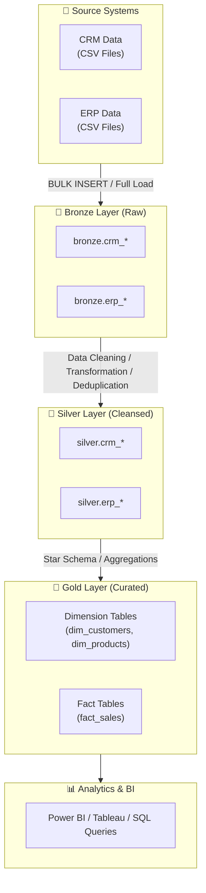

# 🏗️ SQL Data Warehouse Project

Dự án xây dựng hệ thống **Modern Data Warehouse** từ đầu đến cuối (End-to-End) sử dụng **Microsoft SQL Server (T-SQL)** theo kiến trúc phân lớp **Medallion Architecture** (Bronze ➔ Silver ➔ Gold). Dự án bao gồm toàn bộ quy trình ETL/ELT, Data Cleaning, Data Transformation, Data Modeling (Star Schema) và phục vụ phân tích dữ liệu (Analytics & BI).

---

## 📌 Mục lục
- [1. Tổng quan kiến trúc](#1-tổng-quan-kiến-trúc)
- [2. Cấu trúc thư mục](#2-cấu-trúc-thư-mục)
- [3. Chi tiết các tầng dữ liệu (Data Layers)](#3-chi-tiết-các-tầng-dữ-liệu-data-layers)
  - [Bronze Layer (Raw Data)](#-bronze-layer-raw-data)
  - [Silver Layer (Cleaned & Standardized)](#-silver-layer-cleaned--standardized)
  - [Gold Layer (Business / Analytical Model)](#-gold-layer-business--analytical-model)
- [4. Nguồn dữ liệu (Data Sources)](#4-nguồn-dữ-liệu-data-sources)
- [5. Hướng dẫn cài đặt & Thực thi](#5-hướng-dẫn-cài-đặt--thực-thi)
  - [Bước 1: Khởi tạo Database & Schemas](#bước-1-khởi-tạo-database--schemas)
  - [Bước 2: Tạo DDL & Nạp dữ liệu tầng Bronze](#bước-2-tạo-ddl--nạp-dữ-liệu-tầng-bronze)
  - [Bước 3: Làm sạch & Chuyển đổi sang tầng Silver](#bước-3-làm-sạch--chuyển-đổi-sang-tầng-silver)
  - [Bước 4: Xây dựng Dimensional Model tầng Gold](#bước-4-xây-dựng-dimensional-model-tầng-gold)
- [6. Giám sát & Xử lý lỗi (Error Handling & Logging)](#6-giám-sát--xử-lý-lỗi-error-handling--logging)
- [7. Công nghệ sử dụng](#7-công-nghệ-sử-dụng)

---

## 1. Tổng quan kiến trúc

Dự án áp dụng mô hình **Medallion Architecture**:



---

## 2. Cấu trúc thư mục

```plaintext
sql-data-warehouse-project/
├── datasets/                 # Chứa các file dữ liệu nguồn (.csv)
│   ├── source_crm/           # Dữ liệu từ hệ thống CRM (Khách hàng, Sản phẩm, Bán hàng)
│   └── source_erp/           # Dữ liệu từ hệ thống ERP (Vị trí, Phân loại, Danh mục)
├── docs/                     # Tài liệu thiết kế, Data Dictionary, Kiến trúc hệ thống
├── scripts/                  # Mã nguồn SQL và Stored Procedures
│   ├── bronze/               # Scripts định nghĩa DDL và nạp dữ liệu tầng Bronze
│   │   ├── ddl_bronze.sql
│   │   └── proc_load_bronze.sql
│   ├── silver/               # Scripts định nghĩa DDL và làm sạch/nạp dữ liệu tầng Silver
│   │   ├── ddl_silver.sql
│   │   └── proc_load_silver.sql
│   └── gold/                 # Scripts xây dựng Dimension & Fact Views/Tables tầng Gold
└── tests/                    # Scripts kiểm thử chất lượng dữ liệu & khởi tạo môi trường
    └── init_database.sql     # Khởi tạo Database 'DataWarehouse' và các schema
```

---

## 3. Chi tiết các tầng dữ liệu (Data Layers)

### 🥉 Bronze Layer (Raw Data)
* **Mục tiêu**: Lưu trữ toàn bộ dữ liệu thô nguyên bản từ các file CSV của CRM & ERP mà không qua xử lý.
* **Đặc điểm**:
  - Dữ liệu dạng thô (as-is), kiểu dữ liệu dạng text/chuỗi hoặc kiểu cơ bản.
  - Sử dụng lệnh `BULK INSERT` để nạp dữ liệu số lượng lớn với hiệu năng cao.
  - Stored Procedure `bronze.load_bronze` tự động `TRUNCATE` và nạp lại toàn bộ (Full Load) kèm theo tính toán thời gian chạy (Execution Duration) và khối `TRY...CATCH` bắt lỗi.
* **Bảng dữ liệu**:
  - `bronze.crm_cust_info`: Thông tin khách hàng thô từ CRM.
  - `bronze.crm_prd_info`: Thông tin sản phẩm thô từ CRM.
  - `bronze.crm_sales_details`: Lịch sử đơn hàng thô từ CRM.
  - `bronze.erp_cust_az12`: Dữ liệu bổ sung khách hàng (ngày sinh, giới tính) từ ERP.
  - `bronze.erp_loc_a101`: Dữ liệu quốc gia theo khách hàng từ ERP.
  - `bronze.erp_px_cat_g1v2`: Dữ liệu phân loại danh mục sản phẩm từ ERP.

---

### 🥈 Silver Layer (Cleaned & Standardized)
* **Mục tiêu**: Làm sạch, chuẩn hóa kiểu dữ liệu, loại bỏ dữ liệu trùng lặp (Deduplication) và bổ sung metadata theo dõi.
* **Các bước xử lý**:
  - **Deduplication**: Sử dụng hàm `ROW_NUMBER() OVER (PARTITION BY ... ORDER BY ...)` để giữ lại bản ghi mới nhất.
  - **Data Cleansing**: Loại bỏ khoảng trắng thừa với `TRIM()`, chuẩn hóa chuỗi hoa/thường.
  - **Data Normalization**: Chuẩn hóa mã viết tắt (ví dụ: `M` ➔ `Married`, `S` ➔ `Single`, `M` ➔ `Male`, `F` ➔ `Female`).
  - **Audit Columns**: Thêm cột `dwh_create_date` ghi nhận thời gian xử lý ETL vào kho.
* **Bảng dữ liệu**:
  - `silver.crm_cust_info`
  - `silver.crm_prd_info`
  - `silver.crm_sales_details`
  - `silver.erp_cust_az12`
  - `silver.erp_loc_a101`
  - `silver.erp_px_cat_g1v2`

---

### 🥇 Gold Layer (Business / Analytical Model)
* **Mục tiêu**: Xây dựng mô hình hình sao (**Star Schema**) gồm các bảng **Dimension** và **Fact** tối ưu hóa cho việc truy vấn và báo cáo phân tích.
* **Các đối tượng phân tích chính**:
  - `gold.dim_customers`: Kết hợp thông tin khách hàng từ CRM và ERP (`cust_info` + `cust_az12` + `loc_a101`).
  - `gold.dim_products`: Kết hợp danh mục sản phẩm từ CRM và ERP (`prd_info` + `px_cat_g1v2`).
  - `gold.fact_sales`: Bảng dữ liệu sự kiện bán hàng (`crm_sales_details`) liên kết với các Dimension Keys.

---

## 4. Nguồn dữ liệu (Data Sources)

| Hệ thống nguồn | Tên File | Mô tả nội dung |
| :--- | :--- | :--- |
| **CRM** | `cust_info.csv` | Thông tin định danh khách hàng, họ tên, tình trạng hôn nhân, giới tính, ngày tạo. |
| **CRM** | `prd_info.csv` | Thông tin mã sản phẩm, tên, giá vốn, dòng sản phẩm, ngày hiệu lực. |
| **CRM** | `sales_details.csv` | Thông tin chi tiết đơn hàng, số lượng, doanh thu, ngày đặt/giao/hạn. |
| **ERP** | `cust_az12.csv` | Thông tin nhân khẩu học (ngày sinh, giới tính) của khách hàng. |
| **ERP** | `loc_a101.csv` | Thông tin quốc gia/địa lý của khách hàng. |
| **ERP** | `px_cat_g1v2.csv` | Danh mục, tiểu mục và thông tin bảo trì sản phẩm. |

---

## 5. Hướng dẫn cài đặt & Thực thi

### Bước 1: Khởi tạo Database & Schemas
Mở SQL Server Management Studio (SSMS) hoặc Azure Data Studio, chạy file:
```sql
-- Chạy script tạo Database và 3 schema: bronze, silver, gold
-- Đường dẫn: tests/init_database.sql
```

### Bước 2: Tạo DDL & Nạp dữ liệu tầng Bronze
1. Thực thi script tạo cấu trúc bảng Bronze:
   ```sql
   -- Đường dẫn: scripts/bronze/ddl_bronze.sql
   ```
2. Thực thi script tạo Stored Procedure nạp dữ liệu:
   ```sql
   -- Đường dẫn: scripts/bronze/proc_load_bronze.sql
   ```
3. Chạy thủ tục nạp dữ liệu (Lưu ý kiểm tra đường dẫn file CSV trong procedure):
   ```sql
   EXEC bronze.load_bronze;
   ```

### Bước 3: Làm sạch & Chuyển đổi sang tầng Silver
1. Thực thi script tạo bảng Silver:
   ```sql
   -- Đường dẫn: scripts/silver/ddl_silver.sql
   ```
2. Thực thi procedure làm sạch và nạp dữ liệu Silver:
   ```sql
   -- Đường dẫn: scripts/silver/proc_load_silver.sql
   EXEC silver.load_silver;
   ```

### Bước 4: Xây dựng Dimensional Model tầng Gold
Thực thi các view / table mô hình Star Schema:
```sql
-- Đường dẫn: scripts/gold/
```

---

## 6. Giám sát & Xử lý lỗi (Error Handling & Logging)

Các Stored Procedure trong dự án được thiết kế kèm cơ chế giám sát hoàn chỉnh:
- **Đo lường thời gian (Performance Metrics)**: Ghi nhận thời gian bắt đầu, kết thúc và tổng thời lượng nạp cho từng bảng và toàn bộ batch.
- **Xử lý ngoại lệ (Exception Handling)**: Bọc trong khối `BEGIN TRY ... BEGIN CATCH` để bắt thông điệp lỗi (`ERROR_MESSAGE()`, `ERROR_LINE()`, `ERROR_NUMBER()`) mà không làm gián đoạn transaction ngoài tầm kiểm soát.

---

## 7. Công nghệ sử dụng

- **Database Engine**: Microsoft SQL Server
- **Ngôn ngữ**: T-SQL (Transact-SQL)
- **Công cụ phát triển**: SQL Server Management Studio (SSMS) / Azure Data Studio / VS Code
- **Mô hình kiến trúc**: Medallion Data Architecture (Bronze - Silver - Gold), Star Schema (Kimball Methodology)
- **Quản lý phiên bản**: Git & GitHub
