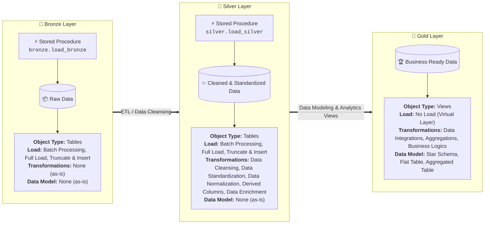
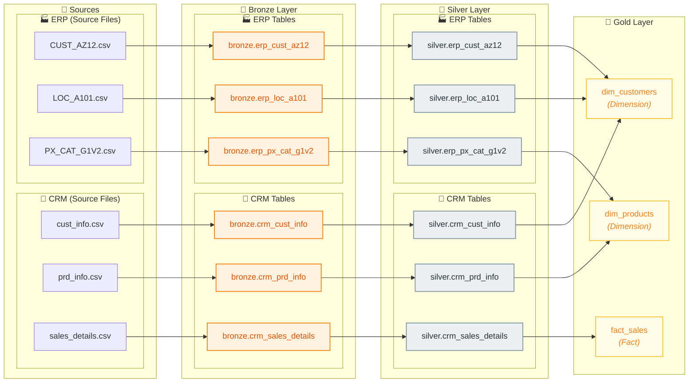
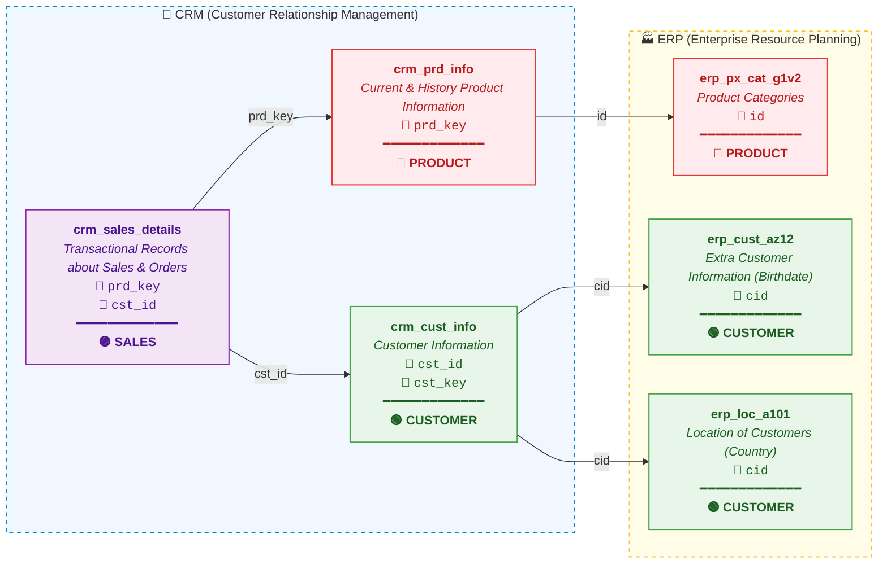
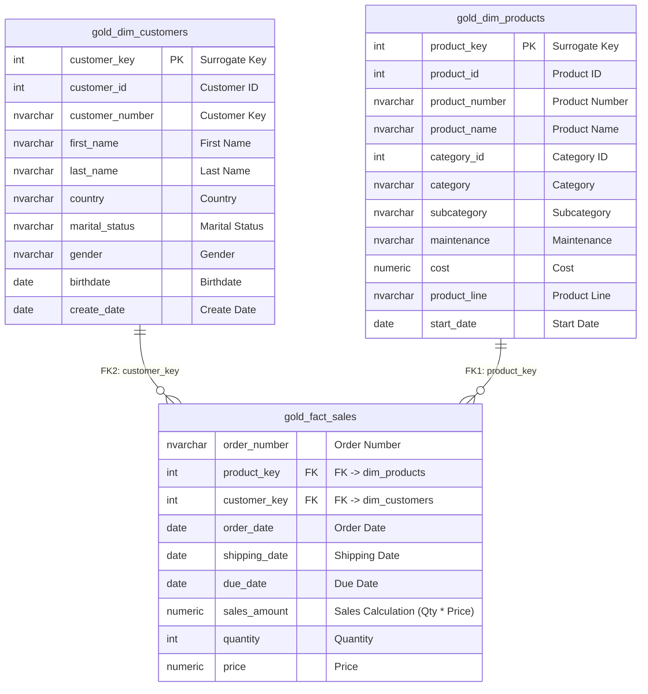

# 📐 Kiến trúc Hệ thống & Mô hình Dữ liệu (Data Architecture & Models)

Tài liệu này tổng hợp toàn bộ các sơ đồ kiến trúc, dòng chảy dữ liệu (Data Lineage), mô hình tích hợp dữ liệu nguồn và mô hình hình sao (Star Schema) của hệ thống **SQL Data Warehouse**.

---

## 📌 Mục lục
1. [Kiến trúc tổng quan (Medallion Architecture)](#1-kiến-trúc-tổng-quan-medallion-architecture)
2. [Luồng dữ liệu & Nguồn gốc (Data Flow / Data Lineage)](#2-luồng-dữ-liệu--nguồn-gốc-data-flow--data-lineage)
3. [Mô hình tích hợp nguồn dữ liệu (Source Integration Model)](#3-mô-hình-tích-hợp-nguồn-dữ-liệu-source-integration-model)
4. [Mô hình hình sao tầng Gold (Star Schema / Dimensional Model)](#4-mô-hình-hình-sao-tầng-gold-star-schema--dimensional-model)

---

## 1. Kiến trúc tổng quan (Medallion Architecture)

Hệ thống Data Warehouse được thiết kế theo mô hình 3 tầng chuẩn (Bronze ➔ Silver ➔ Gold):

### 📋 So sánh đặc điểm các tầng (Layer Comparison)

| Tiêu chí | 🥉 Bronze Layer | 🥈 Silver Layer | 🥇 Gold Layer |
| :--- | :--- | :--- | :--- |
| **Trạng thái dữ liệu** | Dữ liệu thô (Raw Data) | Dữ liệu sạch, chuẩn hóa (Cleaned, Standardized Data) | Dữ liệu sẵn sàng cho nghiệp vụ (Business-Ready Data) |
| **Loại đối tượng (Object Type)** | `Tables` | `Tables` | `Views` |
| **Cơ chế nạp (Load)** | • Batch Processing • Full Load • Truncate & Insert | • Batch Processing • Full Load • Truncate & Insert | • **No Load** (Truy vấn trực tiếp qua Views) |
| **Chuyển đổi (Transformations)** | **No Transformations** | • Data Cleansing • Data Standardization • Data Normalization • Derived Columns • Data Enrichment | • Data Integrations • Aggregations • Business Logics |
| **Mô hình hóa (Data Model)** | None (as-is) | None (as-is) | • Star Schema (Facts & Dimensions) • Flat Table • Aggregated Table |

---

## 2. Luồng dữ liệu & Nguồn gốc (Data Flow / Data Lineage)

Sơ đồ thể hiện chi tiết nguồn gốc và dòng chảy dữ liệu (Data Lineage) từ các tập tin nguồn qua từng tầng, được phân nhóm **CRM hoàn chỉnh trước rồi đến ERP**:

### 🔄 Chi tiết luồng tích hợp tầng Gold:
- **`gold.dim_customers`**: Tích hợp từ `silver.crm_cust_info` (CRM) + `silver.erp_cust_az12` (ERP) + `silver.erp_loc_a101` (ERP).
- **`gold.dim_products`**: Tích hợp từ `silver.crm_prd_info` (CRM) + `silver.erp_px_cat_g1v2` (ERP).
- **`gold.fact_sales`**: Nạp từ `silver.crm_sales_details` (CRM).

---

## 3. Mô hình tích hợp nguồn dữ liệu (Source Integration Model)

Sơ đồ thể hiện mối quan hệ giữa các bảng nguồn từ 2 hệ thống **CRM** và **ERP** theo các miền nghiệp vụ (**Domain: CUSTOMER, PRODUCT, SALES**):

### 🏷️ Phân loại theo Miền nghiệp vụ (Business Domains):
- 🟢 **CUSTOMER (Khách hàng)**:
  - `crm_cust_info` (CRM - Thông tin định danh, tên, hôn nhân, giới tính)
  - `erp_cust_az12` (ERP - Ngày sinh `bdate`, giới tính `gen`) liên kết qua `cid = cst_key`
  - `erp_loc_a101` (ERP - Vị trí quốc gia `cntry`) liên kết qua `cid = cst_key`
- 🔴 **PRODUCT (Sản phẩm)**:
  - `crm_prd_info` (CRM - Thông tin sản phẩm, giá vốn, dòng sản phẩm, ngày hiệu lực)
  - `erp_px_cat_g1v2` (ERP - Danh mục `cat`, tiểu mục `subcat`, bảo trì `maintenance`) liên kết qua `id = cat_id`
- 🟣 **SALES (Bán hàng & Đơn hàng)**:
  - `crm_sales_details` (CRM - Chi tiết đơn hàng, số lượng, doanh thu) liên kết tới Sản phẩm qua `prd_key` và Khách hàng qua `cst_id`

---

## 4. Mô hình hình sao tầng Gold (Star Schema / Dimensional Model)

Sơ đồ thể hiện thiết kế Dimensional Model tầng Gold gồm bảng Fact trung tâm liên kết với các bảng Dimension qua Surrogate Keys:

### 📋 Chi tiết các quan hệ (Relationships):
- **`gold.dim_customers` ➔ `gold.fact_sales`**: Quan hệ 1 - N qua `customer_key`. Mỗi khách hàng có thể có nhiều giao dịch bán hàng.
- **`gold.dim_products` ➔ `gold.fact_sales`**: Quan hệ 1 - N qua `product_key`. Mỗi sản phẩm có thể xuất hiện trong nhiều dòng đơn hàng.
